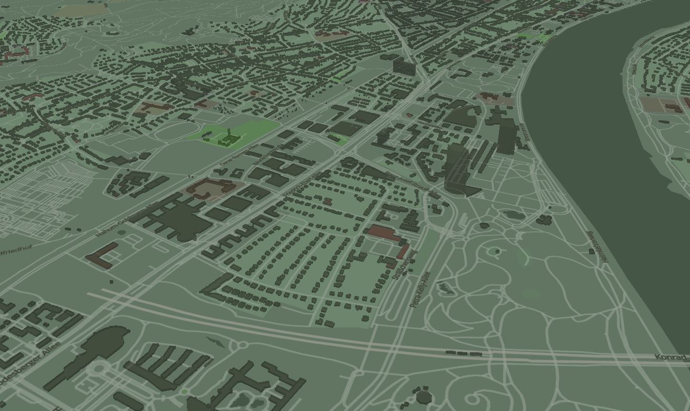
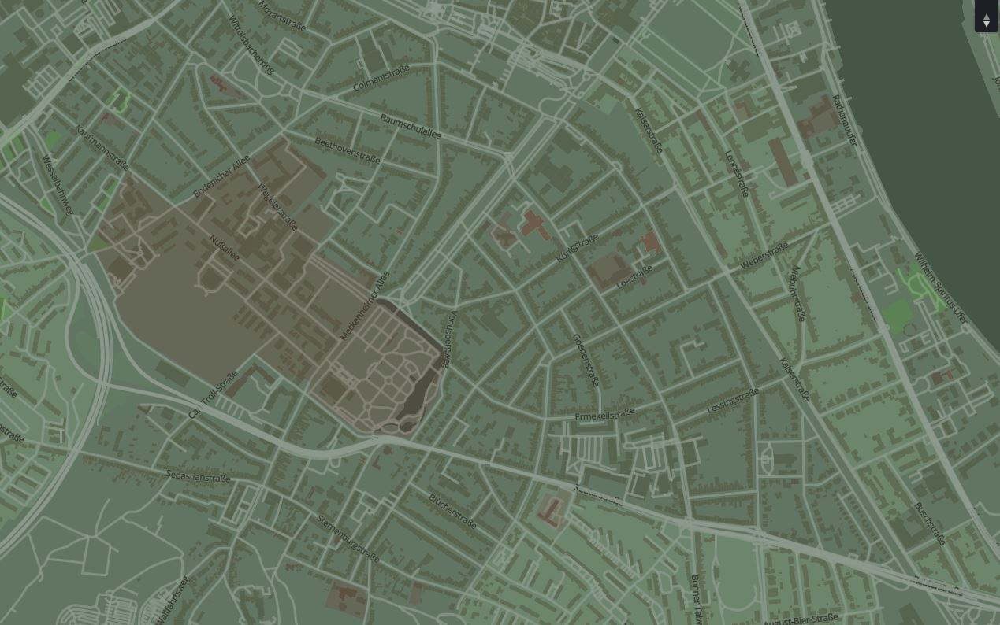

# CamoStyle
This is a draft sample style for use w/ Tegola/Maputnik.

- [View the style as an OpenLayers map in the browser](http://htmlpreview.github.io/?https://github.com/PetersonGIS/CamoStyle/blob/master/live-map.html) (note that text and tilt are not currently functioning)
- [View the style rendered with mapbox in the browser](http://www.gretchenpeterson.com/live-map-mapbox.html#14.66/50.7173/7.1318/-52/60) (sprites, text, and tilt working)
- Clipping issues at zoom 15 & higher to be fixed soon
- The bonn_lakes data layer is missing a few pieces of the Rhine River
- If Maputnik doesn't recenter for you, try #11.5/50.7377/7.1119

