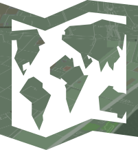

# CamoStyle 
This is a map style that uses a publically available [Tegola](https://github.com/terranodo/tegola) tileset of the world. It is currently still under development.

## Viewing the map in the browser
- [Rendered with OpenLayers:](https://htmlpreview.github.io/?https://github.com/PetersonGIS/CamoStyle/blob/master/live-map.html)
Note that the water texture and tilt functionality are missing from this map, which displays the camo.json style.
- [Rendered with Mapbox:](http://www.gretchenpeterson.com/live-map-mapbox.html) 
This map displays the camo3d.json style. Test the tilt (pitch) functionality by holding ctrl while clicking and dragging on a desktop. 

## Map Design

The CamoStyle basemap has a subdued color scheme to accomodate data overlays while being unique from other light basemap designs. Use camo.json for OpenLayers and camo3d.json for Mapbox implementations. These two json files use some of the newest Mapbox GL JS styling options and therefore aren't functional in Maputnik. To use these styles as springboards for your own styles, then, it is currently recommended to hand edit the json. 

Note that camo.json and camo3d.json use data extracted from OSM and Natural Earth Data and hosted using Tegola. See [tegola-osm](https://github.com/terranodo/tegola-osm) for a list of available layers in this vector tileset. You may want to explore using other open tilesets as well.

 
